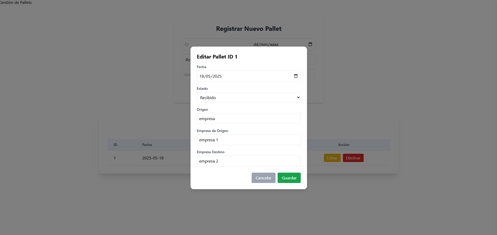
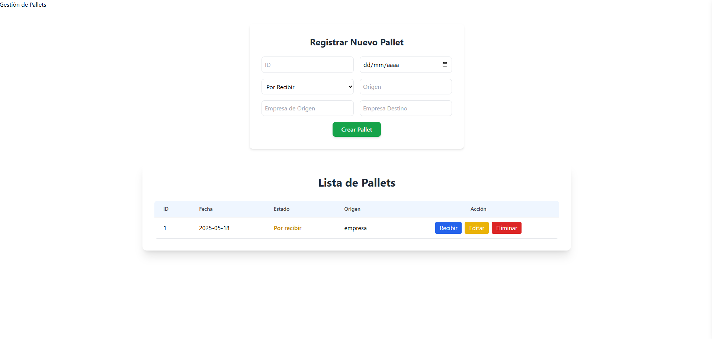

# 📦 Pallets App - Sistema de Gestión de Recepción de Pallets

Aplicación web para registrar, listar, editar y controlar la recepción de pallets en una planta empacadora de productos del mar.

---

## 📌 Características

- Crear pallets con origen, destino y estado.
- Marcar pallets como **recibidos**.
- Editar todos los datos de un pallet.
- Eliminar registros con confirmación.
- Modal con detalles del pallet al hacer clic en la fila.
- UI moderna con **Tailwind CSS** y alertas con **SweetAlert2**.
- Backend API REST robusta con **Django REST Framework**.
- Totalmente dockerizado.

---

## 🧱 Tecnologías Usadas

### 🖥️ Frontend

- React + TypeScript
- Vite
- Tailwind CSS
- SweetAlert2
- React Testing Library

### ⚙️ Backend

- Django 5 + Django REST Framework
- PostgreSQL
- pytest

---

## 🚀 Instalación

### 1. Clonar el repositorio

```bash
git clone https://github.com/xtaxx12/pallets-app.git
cd pallets-app
```

### 2. Configuración del entorno

#### Backend

```bash
cd backend
python -m venv venv
source venv\Scripts\activate 
pip install -r requirements.txt
python manage.py migrate
python manage.py runserver
```

#### Frontend

```bash
cd frontend
npm install
npm run dev
```

La app se abrirá en [http://localhost:5173](http://localhost:5173)

---

## 🧪 Pruebas

### Backend

```bash
pytest
```

### Frontend

```bash
npm run test
```

---

## 🐳 Docker

```bash
docker-compose up --build
# o en segundo plano
docker-compose up -d
```

---

## 🖼️ Capturas 





---

## 📂 Estructura del Proyecto

```
pallets-app/
├── backend/
│   ├── manage.py
│   ├── backend/
│   ├── pallets/
├── frontend/
│   ├── src/
│   │   ├── components/
│   │   │   ├── PalletList.tsx
│   │   │   ├── PalletForm.tsx
│   │   │   ├── PalletDetail.tsx
│   ├── public/
├── docker-compose.yml
├── README.md
```

---

## 👨‍💻 Autor

- Desarrollado por Joel Rojas  
- Contacto: rojassebas765@gmail.com 
- GitHub: https://github.com/xtaxx12

---

## 📃 Licencia

Este proyecto está bajo la licencia MIT.  
Consulta el archivo `LICENSE` para más detalles.
